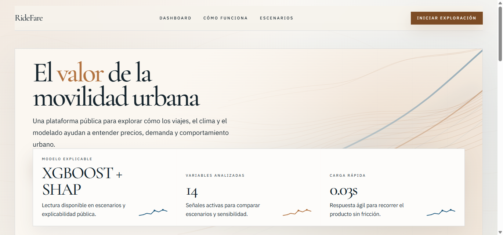
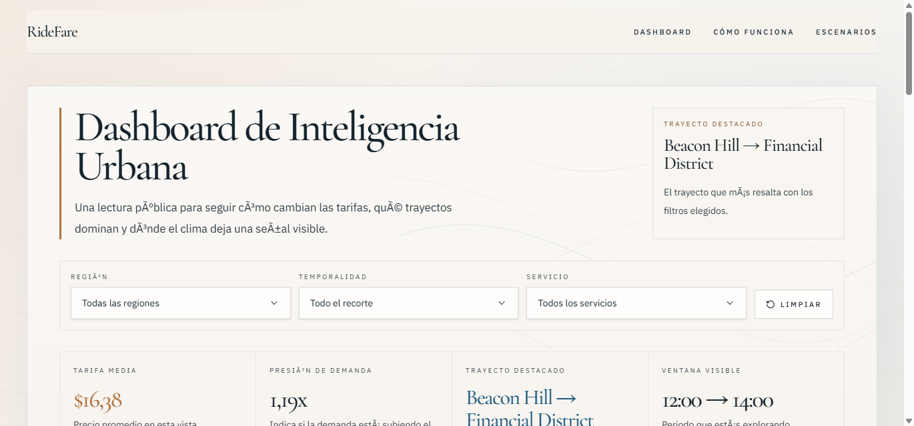
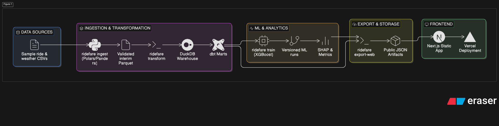

# RideFare

<div align="center">


<br>

<a href="https://ride-fare-etl-pipeline-web.vercel.app/">
  
</a>

</div>

RideFare is a portfolio-grade pricing intelligence product that rebuilds a notebook-centered ride fare analysis into a reproducible data pipeline, a documented ML workflow, and a public Spanish-language web app. The repository shows how raw ride and weather files become validated marts, explainable model artifacts, and a deployed editorial interface for urban mobility storytelling.

## Project Overview

| Challenge | System | Outcome |
|---|---|---|
| Legacy analysis lived in a notebook and ad-hoc scripts | Rebuilt as Python commands, `DuckDB` + `dbt` marts, and typed frontend contracts | Reproducible pipeline from raw CSVs to deployed product |
| Public pricing story needed to work without a live inference API | Versioned JSON exports feed a static-first `Next.js` experience | Stable previews, deterministic deploys, and transparent artifacts |
| Model outputs had to be explainable enough for portfolio storytelling | Temporal evaluation, SHAP exports, and a bounded scenario simulator | ML behavior is visible in docs, artifacts, and the public UI |

## Public Product

RideFare ships four public routes:

- `/` introduces the project as an editorial analytics product
- `/dashboard` turns the analytics mart into a public pricing intelligence surface
- `/como-funciona` translates the pipeline and ML workflow into reader-friendly narrative
- `/escenarios` exposes the exported simulator artifacts through an explainable scenario lab

<div align="center">
  
</div>

<table>
  <tr>
    <td></td>
    <td></td>
  </tr>
</table>

## Architecture Overview




## Technical Stack

| Layer | Stack | Role |
|---|---|---|
| Data ingestion | `Python`, `Polars`, `Pandera` | validate, normalize, and store clean ride/weather inputs |
| Analytics modeling | `DuckDB`, `dbt`, `Parquet` | build stable marts for analytics and ML consumption |
| Machine learning | `scikit-learn`, `XGBoost`, `SHAP` | temporal evaluation, baseline comparison, explainability, and exports |
| Web product | `Next.js`, `TypeScript`, `Tailwind CSS`, `Framer Motion`, `Apache ECharts` | deliver the public Spanish-language interface |
| Automation | `pytest`, `Ruff`, `GitHub Actions`, `release-please`, `Vercel` | validate, refresh artifacts, deploy previews/production, and manage releases |

## Operational Interfaces

The implementation converges on these repo-level interfaces:

- `ridefare ingest`
- `ridefare transform`
- `ridefare train`
- `ridefare export-web`
- `scripts/refresh-public-artifacts.ps1`
- versioned public artifacts under:
  - `data/processed/analytics/web`
  - `data/processed/ml/web`

## Quick Start

```powershell
powershell -ExecutionPolicy Bypass -File .\scripts\bootstrap.ps1
powershell -ExecutionPolicy Bypass -File .\scripts\refresh-public-artifacts.ps1 -RunId local-demo
powershell -ExecutionPolicy Bypass -File .\scripts\validate-python.ps1
corepack pnpm --filter web dev
```

If you want to run the pipeline step by step instead of the refresh wrapper:

```powershell
ridefare ingest --rides-path data/samples/raw/PFDA_rides.csv --weather-path data/samples/raw/PFDA_weather.csv
ridefare transform
ridefare train --run-id local-demo
ridefare export-web --run-id local-demo
```

## Automation and Deployment

- `ci.yml` validates Python, regenerates public artifacts in workspace, and verifies the web build against those exports
- `pipeline-refresh.yml` refreshes the public JSON subsets when backend or sample data changes reach `master`
- `vercel-preview.yml` publishes preview deployments for pull requests
- `vercel-production.yml` deploys the production site from `master`
- `release-please.yml` manages release PRs and changelog automation

Operational details live in:

- [docs/runbooks/local-development.md](./docs/runbooks/local-development.md)
- [docs/runbooks/deployment.md](./docs/runbooks/deployment.md)
- [docs/runbooks/release-process.md](./docs/runbooks/release-process.md)

## Repository Structure

```text
RideFare/
|- apps/web/                     # Public product in Spanish
|- src/ridefare/                 # Production Python package
|- dbt/                          # Analytics and ML marts
|- data/                         # Raw, interim, processed, and sample zones
|- docs/                         # Architecture, ML, UI, ADRs, and runbooks
|- tests/                        # Unit and integration coverage
|- scripts/                      # Bootstrap, validation, and artifact refresh helpers
`- .github/workflows/            # CI, refresh, deploy, and release automation
```

## Limitations and Non-Goals

- RideFare is not an online inference service
- the public simulator consumes exported artifacts, not live backend predictions
- the current sample data is intentionally small for reproducible portfolio execution
- auth, user accounts, and stateful product features remain out of scope
- the legacy notebook is preserved only as reference material, not as the operational center

<div align="center">

### Author

**Samir Caizapasto**<br />
*Junior Data Engineer & Analyst*

<div style="display: flex; justify-content: center; gap: 10px; margin-bottom: 10px;">
  <a href="https://portafolio-samir-tau.vercel.app/">
    
  </a>
  <a href="https://www.linkedin.com/in/samir-caizapasto/">
    
  </a>
  <a href="mailto:samir.leonardo.caizapasto04@gmail.com">
    
  </a>
</div>

</div>

---

If you find this project useful, please consider giving the repository a star.
